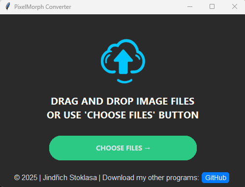

# PixelMorph - User-Friendly Image Converter

PixelMorph is a simple desktop application for converting images between various formats.



## Features

- Drag and drop interface for easy image uploading
- Support for multiple image formats: PNG, JPEG, WEBP, BMP, TIFF, GIF, ICO, EPS, PDF, PSD
- Option to choose output format
- Automatic creation of output folders
- User-friendly interface with platform-specific elements
- Direct opening of output folder from the application
- Multi-threaded image conversion for better performance


## Installation

### Windows

**Option 1: Installer**

1. Download the latest PixelMorph-Win-setup.exe from [releases](https://github.com/jindrichstoklasa/PixelMorph/releases)
2. Run the installer and follow the on-screen instructions
3. Launch PixelMorph from your Start menu

**Option 2: Standalone Version**

1. Download the latest PixelMorph-Win-standalone.zip from [releases](https://github.com/jindrichstoklasa/PixelMorph/releases)
2. Extract the ZIP file to a location of your choice
3. Run PixelMorph.exe directly without installation

### Linux

1. Clone the repository:

```
git clone https://github.com/jindrichstoklasa/PixelMorph.git
```

2. Navigate to the project directory:

```
cd PixelMorph
```

3. Install the required dependencies:

```
pip install -r requirements.txt
```

4. Run the application:

```
python src/PixelMorph.py
```

## Usage

1. Launch the PixelMorph application.
2. Drag and drop images onto the application window, or use the "Select Files" button to choose images.
3. Select the desired output format from the dropdown menu.
4. Click the "Convert" button to start the conversion process.
5. Once complete, use the "Open Output Folder" button to access your converted images.

## License

This project is licensed under the MIT License - see the [LICENSE](LICENSE) file for details.

## Authors

- [@jindrichstoklasa](https://github.com/jindrichstoklasa)


## Acknowledgments

- [Pillow](https://python-pillow.org/) for image processing capabilities
- [PyQt5](https://www.riverbankcomputing.com/software/pyqt/) for the graphical user interface